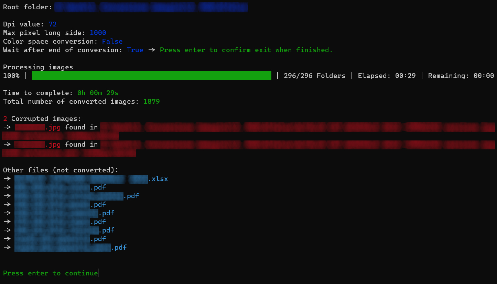
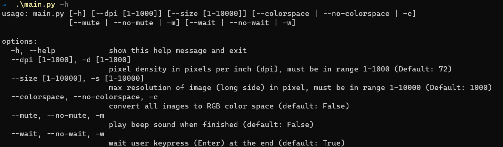

# Batch-Image-Converter

## Summary

Python script that convert images to a certain dpi, max long side resolution and rgb color space. If images are not in jpg or png then they are all converted to jpg.

## Instructions

### Linux

- `git clone https://github.com/EdoardoTosin/Batch-Image-Converter.git`
- `cd Batch-Image-Converter/src && python3 -m pip install -r requirements.txt`
- Copy `main.py` into the folder you want to convert all images.
- `python3 main.py`
- Help screen: `python3 main.py -h`

### Windows

- `git clone https://github.com/EdoardoTosin/Batch-Image-Converter.git`
- `cd Batch-Image-Converter\src; python -m pip install -r requirements.txt`
- Copy `main.py` into the folder you want to convert all images.
- Double click `main.py` to start it with default parameters or launch via terminal with `python main.py`.
- Help screen: `python main.py -h`

## Commands

> Append the following string before calling main.py script based on your operating system:
> 
> - Linux: `python3`
> - Windows: `python`

### Command help [-h, --help]

Show help message and exit

Usage: `main.py -h`

### Command dpi [--dpi, -d]

Set pixel density in pixels per inch (dpi), must be in range 1-1000 (Default: 72).

Usage: `main.py -d 72`

### Command size [--size, -s]

Set max resolution of image (long side) in pixel, must be in range 1-10000 (Default: 1000)".

Usage: `main.py -s 1000`

### Command colorspace [--colorspace, --no-colorspace, -c]

Set color space to RGB (default: False).

| True         | False           |
| ------------ | --------------- |
| --colorspace | --no-colorspace |
| -c           |                 |

Usage: `main.py -c`

### Command mute [--mute, --no-mute, -m]

Convert all images to RGB color space (default: False).

| True   | False     |
| ------ | --------- |
| --mute | --no-mute |
| -m     |           |

Usage: `main.py -m`

### Command wait [--wait, --no-wait, -w]

Wait user keypress (`Enter`) at the end (default: True).

| True   | False     |
| ------ | --------- |
| --wait | --no-wait |
| -w     |           |

Usage: `main.py -w`

## License

This software is released under the terms of the GNU General Public License v3.0. See the [LICENSE](https://github.com/EdoardoTosin/Batch-Image-Converter/tree/main/LICENSE) file for further information.
