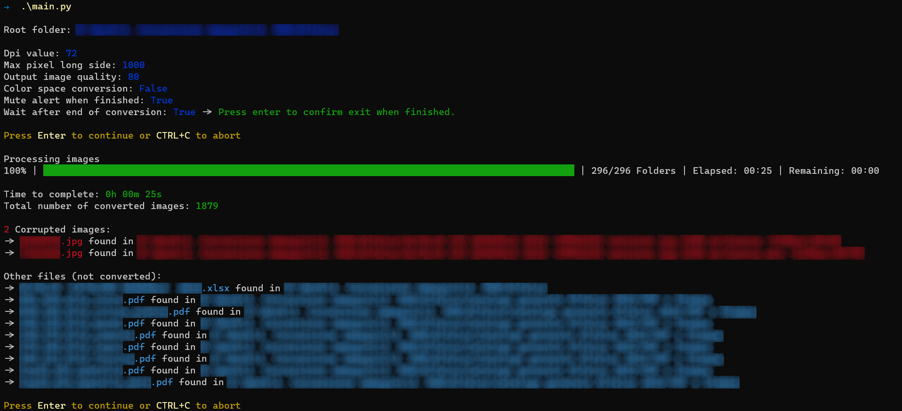

# Batch-Image-Converter

---

## Summary

Simple script written in Python that converts all images found within the folder where the script is located (and all sub-folders); if the images are not in png or jpg (and jpeg) type, then it converts them to the latter one.  
Among the options there is the possibility of setting the quality, the maximum resolution in pixels of the long side of the image while maintaining the aspect ratio (without upscaling if smaller) and changing the dpi.  
There is the possibility to convert all images to the RGB colour space (Important: ICC colour profiles are not used for this conversion so switching between different formats may result in incorrect colours).  
It also prints out a list of all corrupted images and any other files found.  
The following formats are recognised: jpg, jpeg, png, tif, tiff, bmp, psd, psb.  

> **Warning**: psd and psb file types have not been tested.

## Instructions

### Linux

- `git clone https://github.com/EdoardoTosin/Batch-Image-Converter.git`
- `cd Batch-Image-Converter/src && python3 -m pip install -r requirements.txt`
- Copy `main.py` into the folder you want to convert all images.
- `python3 main.py`
- Help screen: `python3 main.py -h`

### Windows

- `git clone https://github.com/EdoardoTosin/Batch-Image-Converter.git`
- `cd Batch-Image-Converter\src; python -m pip install -r requirements.txt`
- Copy `main.py` into the folder you want to convert all images.
- Double click `main.py` to start it with default parameters or launch via terminal with `python main.py`.
- Help screen: `python main.py -h`

> **Note**: append the following string before calling main.py script based on your operating system.
> 
> - Linux: `python3`
> - Windows: `python`

## Help :sos: [-h, --help]

Show help message and exit.

Usage: `main.py -h`

## Version [-v, --version]

Show versione message and exit.

Usage: `main.py -v`

## Image conversion properties

### Path [-p, --path]

Set path where images are located (default: Folder where this script is located).

Usage:

- Windows: `main.py -p "C:\Windows\Log"`
- Linux: `main.py -p "/var/log"`

### Dpi [-d, --dpi]

Set pixel density in pixels per inch (dpi), must be in range 1-1000 (default: 72).

Usage: `main.py -d 72`

### Max Resolution [-s, --size]

Set max resolution of image (long side) in pixel (downscaling only), must be in range 1-10000 (default: 1000).

Usage: `main.py -s 1000`

### Resize Filter [-f, --filter]

Set type of filter used for downscaling, must be an integer in range 0-3 (default: 0 = Nearest).

| 0       | 4   | 2        | 5       | 3       | 5       |
| ------- | --- | -------- | ------- | ------- | ------- |
| Nearest | Box | Bilinear | Hamming | Bicubic | Lanczos |

Usage: `main.py -f 0`

### Color space [--colorspace, --no-colorspace, --cs, --no-cs]

Set color space to RGB (default: False).

> **Warning**: converting CYMK to RGB might not be accurate because the script doesn't use the icc profiles.

| True         | False           |
| ------------ | --------------- |
| --colorspace | --no-colorspace |
| --cs         | --no-cs         |

Usage: `main.py --colorspace` or `main.py --no-colorspace`

### Quality [-q, --quality]

Set quality of output images, must be in range 1-100 (values above 95 should be avoided) (default: 80).

Usage: `main.py -q 80`

### Optimize [--optimize, --no-optimize]

Attempt to compress the palette by eliminating unused colors (default: True).

| True       | False         |
| ---------- | ------------- |
| --optimize | --no-optimize |

Usage: `main.py --optimize` or `main.py --no-optimize`

## Customize script behaviour

### Alert :bell: [--alert, --no-alert]

Play alert sound when finished the conversion (default: True).

| True   | False     |
| ------ | --------- |
| --mute | --no-mute |

Usage: `main.py --mute`

### Wait :raised_hand: [--wait, --no-wait]

Wait user keypress (`Enter`) when finished the conversion (default: True).

| True   | False     |
| ------ | --------- |
| --wait | --no-wait |

Usage: `main.py --wait` or `main.py --no-wait`

## License

This software is released under the terms of the GNU General Public License v3.0. See the [LICENSE](https://github.com/EdoardoTosin/Batch-Image-Converter/tree/main/LICENSE) file for further information.
